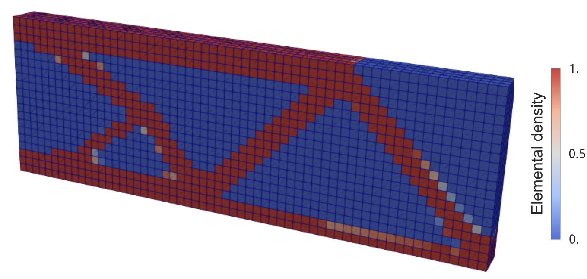
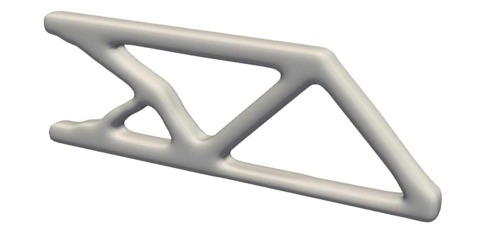

## Overview
This package converts density-based topology optimization results (from SIMP method) into smooth geometry defined by Signed Distance Functions (SDFs). The transformation precisely preserves the volume of the original optimized structure while eliminating jagged boundaries and intermediate density regions, making the resulting geometry suitable for manufacturing and further analysis.

<p align="center">
  
  
</p>


## Installation

```julia
using Pkg
Pkg.add(url="https://github.com/kopacja/rho2sdf.jl")
```

Or clone the repository and set up the environment:

```bash
git clone https://github.com/kopacja/rho2sdf.jl.git
cd rho2sdf.jl
julia --project=. -e "using Pkg; Pkg.instantiate()"
```

Then activate the project in Julia:

```julia
using Pkg
Pkg.activate(".")
using Rho2sdf
```


## Quick Start

```julia
using rho2sdf

# Basic usage with default options
result = rho2sdf("example", X, IEN, rho)

# Custom configuration
options = Rho2sdfOptions(
    threshold_density=0.5,
    sdf_grid_setup=:automatic,
    export_nodal_densities=true
)
result = rho2sdf("example", X, IEN, rho, options=options)
```

## Main Function

```julia
rho2sdf(taskName, X, IEN, rho; options=Rho2sdfOptions())
```

**Parameters:**

- `taskName::String`: Base name for output files
- `X::Vector{Vector{Float64}}`: Mesh node coordinates
- `IEN::Vector{Vector{Int64}}`: Element connectivity
- `rho::Vector{Float64}`: Element densities
- `options::Rho2sdfOptions`: Configuration options (optional)

**Returns:**

- `Tuple`: (fine_sdf, fine_grid, sdf_grid, sdf_dists)
- Exports `.vti` files for ParaView visualization

## Configuration Options

```julia
Rho2sdfOptions(;
    threshold_density=nothing,          # Density threshold for isosurface (auto if nothing)
    sdf_grid_setup=:manual,            # :manual or :automatic grid setup
    export_input_data=false,           # Export input data to VTU
    export_nodal_densities=false,      # Export nodal densities to VTU
    export_raw_sdf=false,             # Export raw SDF to VTI
    rbf_interp=true,                  # Use RBF interpolation/approximation
    rbf_grid=:same,                   # :same or :fine grid resolution
    remove_artifacts=true,            # Remove small disconnected components
    artifact_min_component_ratio=0.01, # Minimum size ratio for components
    export_analysis=false,            # Export analysis files
    element_type=HEX8                 # Element type (HEX8 or TET4)
)
```

## Element Type Support

The package supports both hexahedral and tetrahedral elements:

```julia
# For hexahedral elements (default)
result = rho2sdf_hex8("example", X, IEN, rho)

# For tetrahedral elements
result = rho2sdf_tet4("example", X, IEN, rho)
```

## Test Cases

Release 0.1.0 includes test cases (`test_cases.zip`) covering:

- SDF validation with geometric primitives
- Grid resolution convergence studies
- Engineering applications (cantilever beam, robot gripper)

Run tests with:
```julia
julia --project=. test_cases/run_all_test_cases.jl
```

## Output Files

The package generates several output files for analysis and visualization:

- `.vti` files: Structured SDF data for ParaView
- `.vtu` files: Unstructured mesh data with density fields
- `.jld2` files: Julia data for post-processing

## Requirements

- Julia ≥ 1.11
- Dependencies are automatically managed by the package manager
